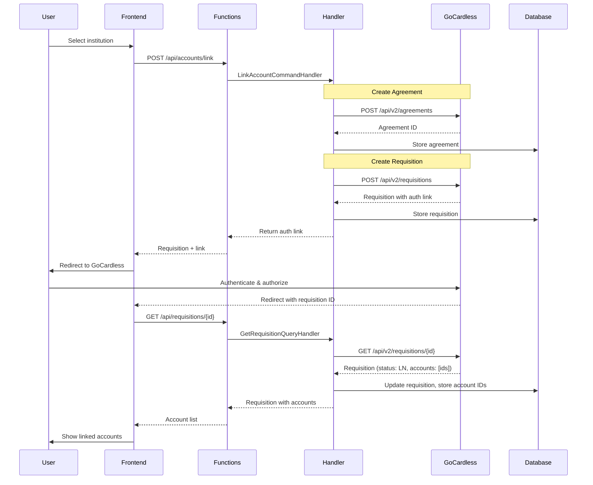
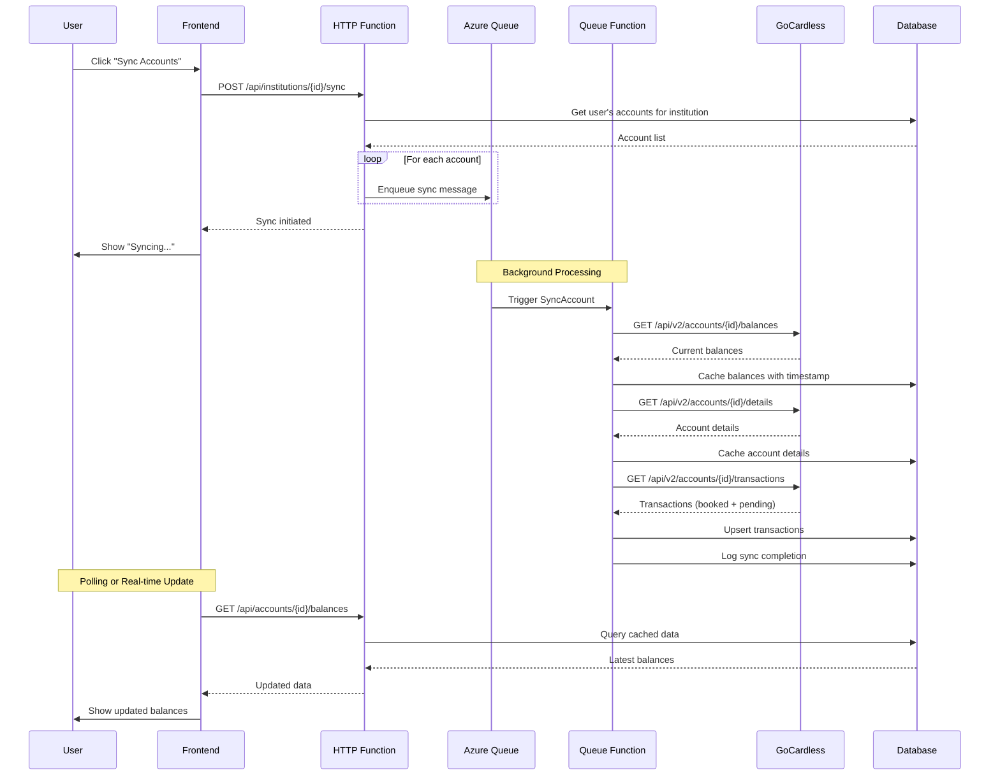
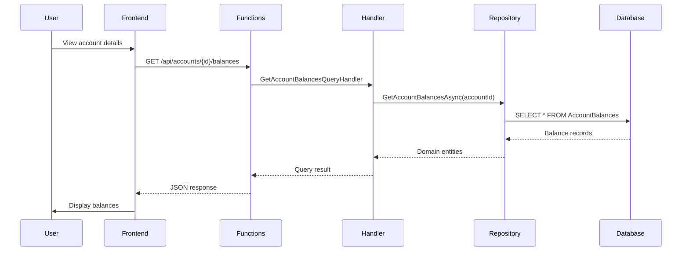
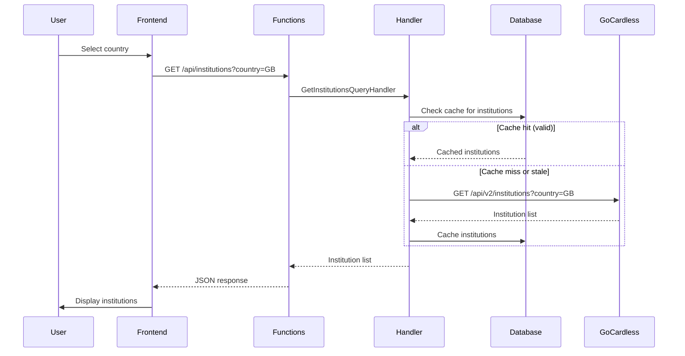
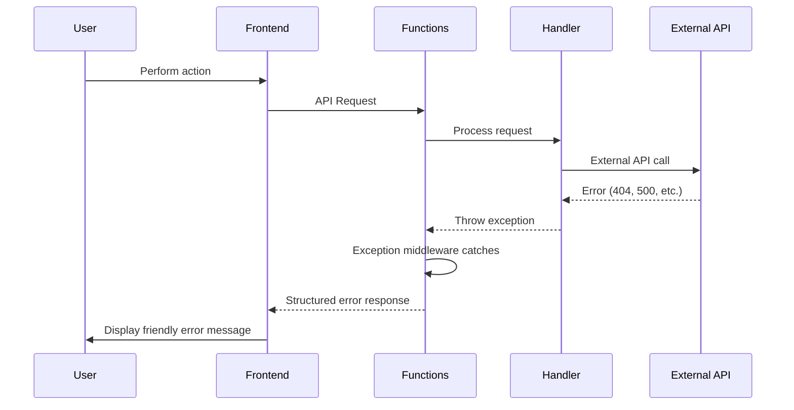

# Data Flow

Understanding how data flows through the Networth application is crucial for development and troubleshooting. This page describes the data flow for key user journeys.

## Account Linking Flow



### Steps Explained

1. **User Selection**: User selects a financial institution
2. **Agreement Creation**: Handler creates access agreement with GoCardless
3. **Requisition Creation**: Handler creates requisition for user authorization
4. **User Authorization**: User authenticates with their bank via GoCardless
5. **Account Storage**: System retrieves and stores linked account IDs
6. **Confirmation**: User sees their newly linked accounts

## Account Synchronization Flow



### Steps Explained

1. **Sync Trigger**: User initiates sync for an institution
2. **Job Queuing**: HTTP function enqueues sync job for each account
3. **Background Processing**: Queue function processes each account
4. **Data Fetching**: Fetch balances, details, and transactions from GoCardless
5. **Data Storage**: Cache all fetched data in PostgreSQL
6. **User Update**: Frontend polls or receives updates to show fresh data

## Data Read Flow



### Caching Strategy

- **Balances**: Cached with timestamp, stale after 1 hour
- **Details**: Cached indefinitely (rarely changes)
- **Transactions**: Cached per date range, refreshed on sync

## Institution Discovery Flow



## Data Models

### Domain Entities (Read-Only from API)

```csharp
public record Institution(
    string Id,
    string Name,
    string Bic,
    string LogoUrl,
    IReadOnlyList<string> Countries,
    IReadOnlyList<string> SupportedFeatures
);

public record AccountBalance(
    decimal Amount,
    string Currency,
    string BalanceType,
    DateOnly ReferenceDate
);

public record Transaction(
    string TransactionId,
    string DebtorName,
    string DebtorAccountIban,
    decimal Amount,
    string Currency,
    DateOnly BookingDate,
    DateOnly ValueDate,
    string RemittanceInformation,
    string Status
);
```

### Infrastructure Entities (EF Core)

```csharp
public class AccountBalanceEntity
{
    public Guid Id { get; set; }
    public Guid AccountId { get; set; }
    public decimal Amount { get; set; }
    public string Currency { get; set; } = string.Empty;
    public string BalanceType { get; set; } = string.Empty;
    public DateOnly ReferenceDate { get; set; }
    public DateTime CachedAt { get; set; }
    
    // Navigation properties
    public AccountEntity Account { get; set; } = null!;
}
```

## Error Handling Flow



### Error Categories

1. **Validation Errors**: FluentValidation catches invalid requests
2. **Not Found**: Resource doesn't exist (404)
3. **External API Errors**: GoCardless API failures (retried automatically)
4. **Database Errors**: Connection or query issues
5. **Business Logic Errors**: Domain rule violations

## Performance Considerations

### Database Queries

- **Indexes**: On frequently queried columns (accountId, userId)
- **Batch Operations**: Bulk insert for transactions
- **Connection Pooling**: Configured in EF Core

### API Rate Limiting

- **GoCardless**: Implements retry with exponential backoff
- **Queue Processing**: Prevents overwhelming external API

### Frontend Caching

- **React Query**: 5-minute stale time for most data
- **Optimistic Updates**: UI updates before API confirmation
- **Background Refetch**: Fresh data without blocking UI
