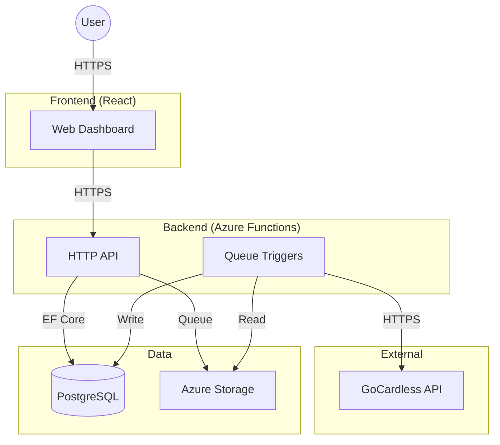

# Technology Stack

Networth is built using modern, reliable technologies to ensure performance, security, and scalability. Here is a high-level view of the resources that power the application.

## System Overview

The application is composed of a frontend dashboard, a backend API, and secure data storage, all orchestrated together.

## Core Technologies

  

    

      

        <h3>🎨 Frontend</h3>
      

      

        <ul>
          <li><strong>React</strong>: Component-based UI library</li>
          <li><strong>Vite</strong>: Next-generation frontend tooling</li>
          <li><strong>Tailwind CSS</strong>: Utility-first CSS framework</li>
          <li><strong>Recharts</strong>: Composable charting library</li>
        </ul>
      

    

  

  

    

      

        <h3>⚙️ Backend</h3>
      

      

        <ul>
          <li><strong>.NET 9</strong>: Latest high-performance framework</li>
          <li><strong>Azure Functions</strong>: Serverless compute</li>
          <li><strong>.NET Aspire</strong>: Cloud-native orchestration</li>
          <li><strong>Refit</strong>: Type-safe REST library</li>
        </ul>
      

    

  

  

    

      

        <h3>💾 Data & Infra</h3>
      

      

        <ul>
          <li><strong>PostgreSQL</strong>: Relational database</li>
          <li><strong>Entity Framework Core</strong>: ORM</li>
          <li><strong>Azurite</strong>: Local Azure Storage emulator</li>
          <li><strong>Docker</strong>: Containerization</li>
        </ul>
      

    

  

## Architecture Highlights

### 1. .NET Aspire Orchestration

Networth uses **.NET Aspire** to manage the local development environment. It automatically spins up the React frontend, Azure Functions backend, PostgreSQL database, and Azurite emulator, handling service discovery and connection strings automatically.

### 2. Serverless Backend

The backend is built entirely on **Azure Functions** (Isolated Worker model). This ensures the application scales to zero when not in use (saving costs) and scales up instantly when needed.

### 3. Clean Architecture

The solution follows a strict **Clean Architecture** pattern:

- **Domain**: Core entities and interfaces (No dependencies)
- **Application**: Business logic, commands, and queries
- **Infrastructure**: Database implementation and external API clients
- **Functions**: Entry points (Controllers)

### 4. Secure Aggregation

We use **GoCardless** (formerly Nordigen) for Open Banking connectivity. Networth never stores your bank credentials; it only stores the secure tokens needed to fetch read-only transaction data.
