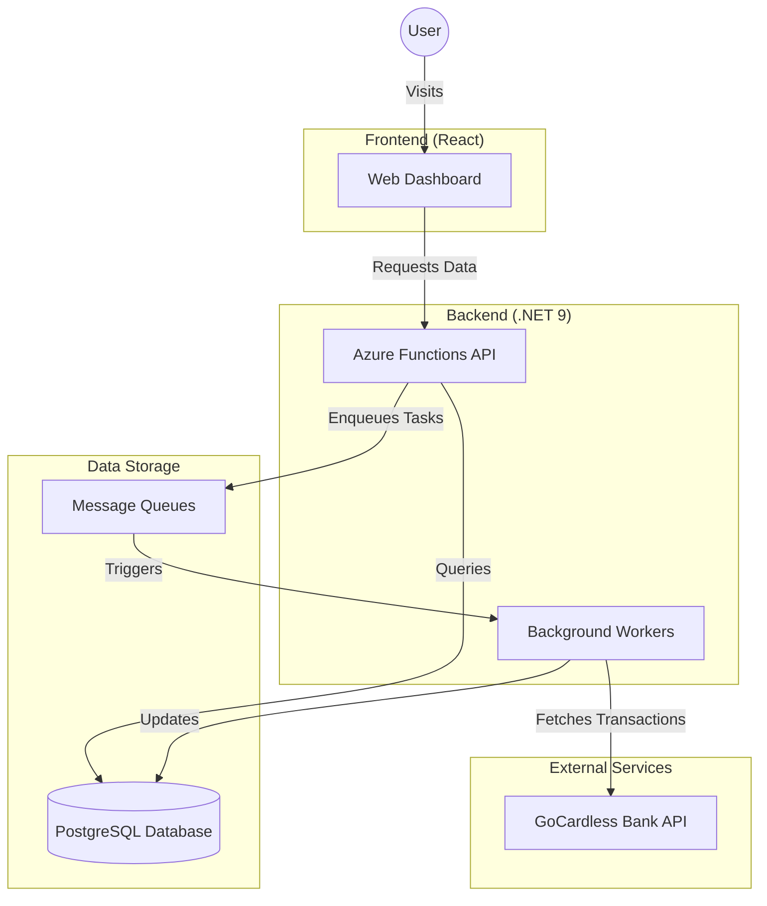
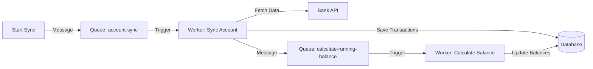

# Technology Stack

Networth is built using modern, reliable technologies to ensure performance, security, and scalability. Here is a high-level view of the resources that power the application.

## System Overview

The application is composed of a frontend dashboard, a backend API, and secure data storage, all orchestrated together.

## Core Technologies

* **React**: Used for the frontend to create a fast, responsive user interface.
* **.NET 9 & Azure Functions**: The backend logic is built with the latest version of .NET, running on serverless Azure Functions for efficiency and scale.
* **PostgreSQL**: A robust, open-source relational database used to securely store your financial data.
* **.NET Aspire**: Acts as the "conductor" of the orchestra, managing how all these different parts start up, communicate, and run together during development.

## Background Workers

Networth uses background workers to handle time-consuming tasks without slowing down the user interface. This ensures that your dashboard remains responsive while we process your data behind the scenes.

### How It Works

1. **Sync Account**: When a sync is requested, a message is sent to the `account-sync` queue. The **Sync Account** worker picks this up, fetches the latest transactions from the bank, and saves them to the database.
2. **Calculate Balance**: Once the transactions are saved, the Sync Account worker sends a message to the `calculate-running-balance` queue. The **Calculate Balance** worker then updates the running balance for your account, ensuring your financial overview is accurate.
