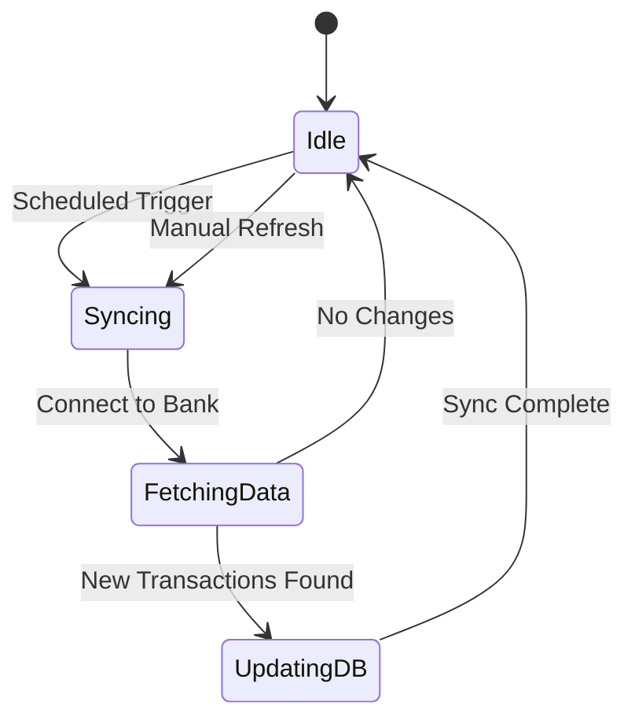

# Data Synchronization

Keeping your financial picture up-to-date is key to making informed decisions. Here is how Networth handles your data updates.

## Automatic Updates

Networth is designed to automatically fetch the latest transaction and balance information from your connected accounts. This happens in the background, so you don't have to manually refresh every time you log in.

## On-Demand Refresh

Need the absolute latest numbers right now? You can trigger a manual refresh from the dashboard. This will prompt Networth to reach out to your banks immediately and pull in any new activity.

## Consistency

We work hard to ensure that the numbers you see on Networth match what you see on your bank's website. If there are ever discrepancies, our system attempts to reconcile them automatically during the next sync cycle.
