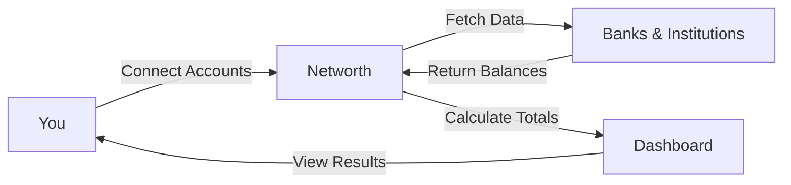

# How Networth Works

Networth simplifies your financial life by bringing everything together. Instead of logging into multiple bank websites to check your balances, Networth does the heavy lifting for you.

## The Big Picture

1. **You Connect Your Accounts**: You authorize Networth to access your account information from supported banks and financial institutions.
2. **We Fetch the Data**: Networth securely retrieves your latest balances and transaction history.
3. **We Crunch the Numbers**: The application calculates your total assets, total liabilities, and your overall net worth.
4. **You See the Results**: All this information is presented to you in a clean, easy-to-read dashboard.

## Designed for You

The system is built to be:

* **Secure**: Your privacy and security are paramount.
* **Fast**: Get a quick snapshot of your finances without the wait.
* **Simple**: No complex spreadsheets or manual entry required.
