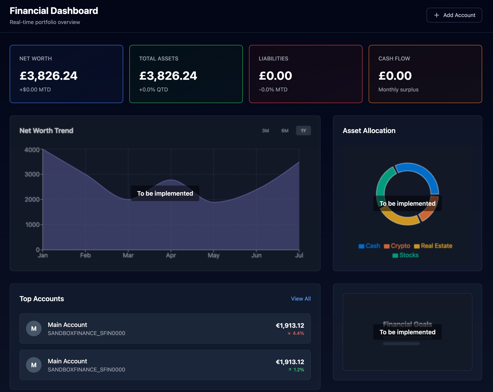

# Networth Application

[](https://github.com/TomSB1423/NetWorth/actions/workflows/backend-ci.yml)
[](https://github.com/TomSB1423/NetWorth/actions/workflows/frontend-ci.yml)
[](https://github.com/TomSB1423/NetWorth/actions/workflows/docs-ci.yml)
[](https://renovatebot.com)
[](https://tomsb1423.github.io/NetWorth/)

Networth is a personal financial aggregation application built with **.NET Aspire**. It allows users to track their net worth, view asset allocation, and sync accounts from various financial institutions using the GoCardless API.

[**Visit the Documentation Site**](https://tomsb1423.github.io/NetWorth/)



## Features

- **Dashboard**: Real-time overview of Net Worth, Total Assets, Liabilities, and Cash Flow.
- **Asset Allocation**: Visual breakdown of assets (Cash, Crypto, Real Estate, Stocks).
- **Account Sync**: Integration with GoCardless to sync bank account balances and transactions.
- **Trend Analysis**: Historical view of net worth over time.

## Tech Stack

- **Orchestration**: .NET Aspire
- **Backend**: Azure Functions (.NET 9 Isolated Worker)
- **Frontend**: React (Vite + Tailwind CSS)
- **Database**: PostgreSQL (EF Core)
- **Infrastructure**: Azure Storage Queues (Azurite for local dev)

## Prerequisites

- [.NET 9 SDK](https://dotnet.microsoft.com/download/dotnet/9.0)
- [Docker Desktop](https://www.docker.com/products/docker-desktop)
- [Node.js](https://nodejs.org/) (optional, for frontend development)

## Running with .NET Aspire

Run the complete application stack (PostgreSQL, Azure Functions, React frontend, Documentation):

```shell
dotnet run --project Networth.AppHost
```

This starts all services including:

- **PostgreSQL** with PgAdmin (port 5050)
- **Azure Functions** backend
- **React** frontend (port 3000)
- **Docusaurus** documentation (port 3001)
- **Aspire Dashboard** (<https://localhost:17065>)

## Documentation

Comprehensive architecture documentation is available in the Docusaurus site:

- **Local**: Run `dotnet run --project Networth.AppHost` and navigate to <http://localhost:3001>
- **Standalone**: See [Networth.Docs/README.md](Networth.Docs/README.md) for running docs independently

The documentation includes:

- Architecture overview and design patterns
- Component documentation (Functions, Application, Infrastructure, Domain)
- Data flow diagrams
- API reference with Scalar integration

## Configuration

### Local Development

Set the following user secrets in the AppHost project using the .NET CLI:

```shell
dotnet user-secrets set "Gocardless:SecretId" "YOUR_SECRET_ID" --project Networth.AppHost
dotnet user-secrets set "Gocardless:SecretKey" "YOUR_SECRET_KEY" --project Networth.AppHost
```

The PostgreSQL password is configured in `appsettings.json`:

```json
"Parameters": {
    "postgres-password": "LocalDevPassword123!"
}
```

## Testing

### System Tests (Playwright)

System tests use Playwright for end-to-end testing. You must install the Playwright browsers before running these tests:

Install the required browsers:

```shell
pwsh Tests/Networth.Functions.System.Tests/bin/Debug/net9.0/playwright.ps1 install
```

## License

This project is licensed under the GNU Affero General Public License v3.0 - see the [LICENSE](LICENSE) file for details.
