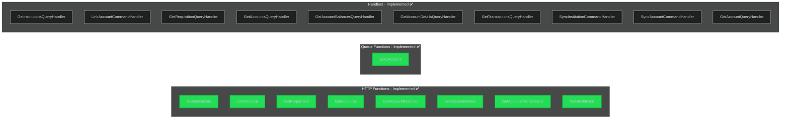
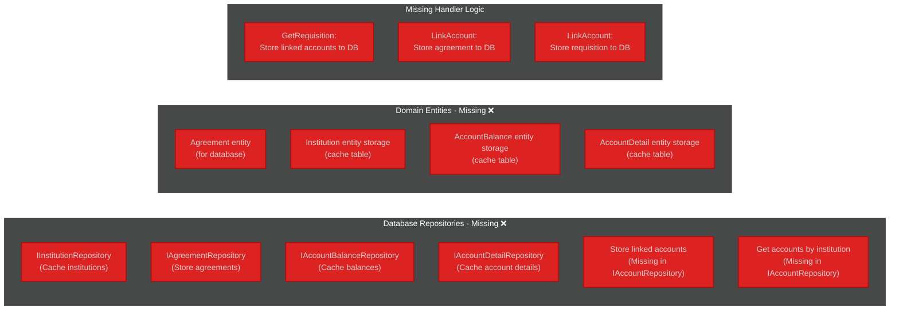
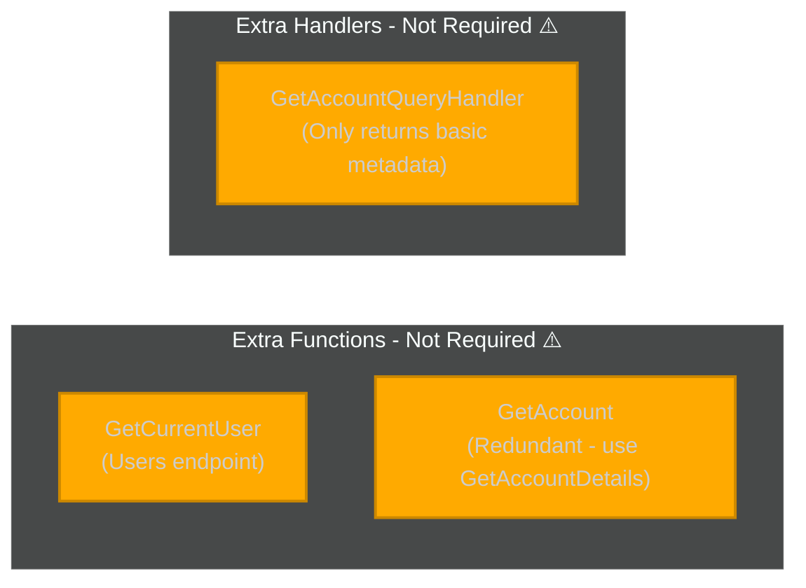

# High Level Flow

institution id: HSBC_HBUKGB4B

link: <https://ob.gocardless.com/ob-psd2/start/55b865e1-334b-4779-a9bb-a18fffd5f5fe/HSBC_HBUKGB4B>

## Mock Initialisation Data

- All Institutions
- Single Agreement
- Single Requisition
- Single Account with Balances, Details, Transactions

## Architecture Overview

### HTTP Functions (Azure Functions)

- `GetInstitutions` - GET /api/institutions?country={country}
- `LinkAccount` - POST /api/accounts/link
- `GetRequisition` - GET /api/requisitions/{requisitionId}
- `GetAccount` - GET /api/accounts/{accountId}
- `GetAccountBalances` - GET /api/accounts/{accountId}/balances
- `GetAccountDetails` - GET /api/accounts/{accountId}/details
- `GetAccountTransactions` - GET /api/accounts/{accountId}/transactions
- `GetAccounts` - GET /api/accounts?userId={userId}
- `SyncInstitution` - POST /api/institutions/{institutionId}/sync

### Queue Functions (Background Jobs)

- `SyncAccount` - Processes account sync from queue (account-sync)

### Data Flow

```mermaid
sequenceDiagram
    participant Frontend
    participant HTTP as HTTP Functions
    participant Queue as Queue Functions
    participant DB as PostgreSQL
    participant GC as GoCardless API

    %% GetInstitutions Function
        note right of Frontend: HTTP: GetInstitutions
        Frontend->>Frontend: User selects country
        Frontend->>HTTP: GET /api/institutions?country=GB
        HTTP->>DB: Query cached institutions
        alt Cache exists and valid
            DB-->>HTTP: Return cached institutions
        else Cache missing/expired
            HTTP->>GC: GET /api/v2/institutions?country=GB
            GC-->>HTTP: Return institutions list
            HTTP->>DB: Cache institutions
        end
        HTTP-->>Frontend: Return institutions
        Frontend->>Frontend: Display institutions list

    %% LinkAccount Function
        note right of Frontend: HTTP: LinkAccount
        Frontend->>Frontend: User selects institution
        Frontend->>HTTP: POST /api/accounts/link<br/>{institutionId, redirect, userId}

        Note over HTTP: Create Agreement
        HTTP->>GC: POST /api/v2/agreements<br/>{institution_id, max_historical_days: 90,<br/>access_valid_for_days: 90,<br/>access_scope: [balances, details, transactions],<br/>reconfirmation: true}
        GC-->>HTTP: Return agreement {id, created, ...}
        HTTP->>DB: Store agreement

        Note over HTTP: Create Requisition
        HTTP->>GC: POST /api/v2/requisitions<br/>{redirect, institution_id, agreement,<br/>reference, account_selection: false}
        GC-->>HTTP: Return requisition {id, link, status: CR, ...}
        HTTP->>DB: Store requisition (status: CR)

        HTTP-->>Frontend: Return {requisitionId, authLink}
        Frontend->>Frontend: Redirect to GoCardless auth

    %% User Authorization (External)
    Frontend->>GC: User authenticates & authorizes
    GC-->>Frontend: Redirect to callback URL
    Frontend->>Frontend: Handle callback with requisition ID

    %% GetRequisition Function
        note right of Frontend: HTTP: GetRequisition
        Frontend->>HTTP: GET /api/requisitions/{id}
        HTTP->>DB: Query cached requisition
        alt Cache exists and status LN
            DB-->>HTTP: Return cached requisition
        else Need refresh
            HTTP->>GC: GET /api/v2/requisitions/{id}
            GC-->>HTTP: Return requisition {status: LN, accounts: [accountId]}
            HTTP->>DB: Update requisition (status: LN, accounts)
        end
        HTTP-->>Frontend: Return requisition with accounts

        Note over HTTP: Store Linked Accounts
        loop For each account in requisition
            HTTP->>DB: Store account metadata<br/>{accountId, institutionId, userId, status}
        end

        Frontend->>Frontend: Display linked accounts

    %% SyncInstitution Function
        note right of Frontend: HTTP: SyncInstitution
        Frontend->>Frontend: User triggers sync
        Frontend->>HTTP: POST /api/institutions/{institutionId}/sync

        Note over HTTP: Get user's accounts for institution
        HTTP->>DB: Query accounts by userId & institutionId
        DB-->>HTTP: Return account list

        Note over HTTP: Enqueue sync jobs
        loop For each account
            HTTP->>DB: Enqueue to account-sync queue<br/>{accountId, userId, dateFrom, dateTo}
        end
        HTTP-->>Frontend: Return {accountIds, queuedCount}
        Frontend->>Frontend: Show sync initiated

    %% SyncAccount Queue Function
        note right of Queue: QUEUE: SyncAccount
        DB->>Queue: Dequeue sync message from account-sync

        Note over Queue: Fetch Account Balances
        Queue->>GC: GET /api/v2/accounts/{id}/balances
        alt Account found (200)
            GC-->>Queue: Return balances
            Queue->>DB: Cache balances (with timestamp)
        else Account not found (404)
            GC-->>Queue: 404 Not Found
            Note over Queue: Skip - account may be deleted
        end

        Note over Queue: Fetch Account Details
        Queue->>GC: GET /api/v2/accounts/{id}/details
        alt Account found (200)
            GC-->>Queue: Return account details
            Queue->>DB: Cache account details
        else Account not found (404)
            GC-->>Queue: 404 Not Found
            Note over Queue: Skip - account may be deleted
        end

        Note over Queue: Fetch Transactions
        Queue->>GC: GET /api/v2/accounts/{id}/transactions?<br/>date_from=YYYY-MM-DD&date_to=YYYY-MM-DD
        alt Account found (200)
            GC-->>Queue: Return transactions {booked, pending}
            Queue->>DB: Upsert transactions<br/>(dedupe by transactionId)
        else Account not found (404)
            GC-->>Queue: 404 Not Found
            Note over Queue: Skip - account may be deleted
        end

        Queue->>DB: Log sync completion<br/>(timestamp, transactionCount)

    %% GetAccounts Function
        note right of Frontend: HTTP: GetAccounts
        Frontend->>Frontend: User views accounts
        Frontend->>HTTP: GET /api/accounts?userId={userId}
        HTTP->>DB: Query user's accounts
        DB-->>HTTP: Return account list
        HTTP-->>Frontend: Return accounts
        Frontend->>Frontend: Display account list

    %% GetAccountBalances Function
        note right of Frontend: HTTP: GetAccountBalances
        Frontend->>Frontend: User views balances
        Frontend->>HTTP: GET /api/accounts/{id}/balances
        HTTP->>DB: Query cached balances
        alt Balances found
            DB-->>HTTP: Return balances
            HTTP-->>Frontend: Return balances
        else Account not found
            DB-->>HTTP: null
            HTTP-->>Frontend: 404 Not Found
        end
        Frontend->>Frontend: Display current balances

    %% GetAccountDetails Function
        note right of Frontend: HTTP: GetAccountDetails
        Frontend->>Frontend: User views details
        Frontend->>HTTP: GET /api/accounts/{id}/details
        HTTP->>DB: Query cached details
        alt Details found
            DB-->>HTTP: Return account details
            HTTP-->>Frontend: Return details
        else Account not found
            DB-->>HTTP: null
            HTTP-->>Frontend: 404 Not Found
        end
        Frontend->>Frontend: Display account details

    %% GetAccountTransactions Function
        note right of Frontend: HTTP: GetAccountTransactions
        Frontend->>Frontend: User views transactions
        Frontend->>HTTP: GET /api/accounts/{id}/transactions?<br/>dateFrom=...&dateTo=...
        HTTP->>DB: Query cached transactions
        alt Transactions found
            DB-->>HTTP: Return transactions
            HTTP-->>Frontend: Return transactions
        else Account not found
            DB-->>HTTP: null
            HTTP-->>Frontend: 404 Not Found
        end
        Frontend->>Frontend: Display transaction history
```

## Gap Analysis

### ✅ Implemented & Required

### ❌ Missing for Initial Flow

### ⚠️ Implemented but Not Needed for Initial Flow

### 📋 Missing Implementation Details

#### 1. **Database Persistence Layer**

- ❌ **IInstitutionRepository** - Cache institutions from GoCardless
- ❌ **IAgreementRepository** - Store created agreements
- ❌ **IAccountBalanceRepository** - Cache balance data with timestamps
- ❌ **IAccountDetailRepository** - Cache account detail data
- ❌ **IAccountRepository.CreateAccountAsync()** - Store linked accounts after requisition
- ❌ **IAccountRepository.GetAccountsByInstitutionAsync()** - Query accounts for SyncInstitution

#### 2. **Database Entities**

- ❌ **Agreement** (Infrastructure entity) - Store agreement records
- ❌ **Institution** (Infrastructure entity) - Cache institution data
- ❌ **AccountBalance** (Infrastructure entity) - Cache balance snapshots
- ❌ **AccountDetail** (Infrastructure entity) - Cache account detail data

#### 3. **Handler Logic Gaps**

- ❌ **LinkAccountCommandHandler** - Missing DB persistence:
  - Store Agreement to database
  - Store Requisition to database
- ❌ **GetRequisitionQueryHandler** - Missing DB persistence:
  - Store/update linked accounts when status = LN
- ❌ **GetInstitutionsQueryHandler** - Missing caching:
  - Check cache before calling GoCardless
  - Store results in cache

#### 4. **Queue Infrastructure**

- ✅ **SyncAccount queue function** exists
- ✅ **IQueueService** interface exists
- ⚠️ Need to verify queue implementation stores to correct queue name

### 🗑️ Can Be Removed/Simplified

1. **GetAccount Function & Handler** - This only returns basic metadata (id, institutionId, status, name) which is already included in GetAccountDetails. Can be removed or merged.

2. **GetCurrentUser Function** - Not part of the core account linking/syncing flow. Can be deferred to user management features.

### ✅ Next Steps Priority

1. **HIGH**: Implement database repositories and entities for caching
2. **HIGH**: Add persistence logic to LinkAccountCommandHandler (store agreement & requisition)
3. **HIGH**: Add persistence logic to GetRequisitionQueryHandler (store linked accounts)
4. **MEDIUM**: Add institution caching in GetInstitutionsQueryHandler
5. **LOW**: Consider removing GetAccount endpoint (use GetAccountDetails instead)

## Function Details

Get institutions

GET /api/v2/institutions

Response 200 OK
[
  {
    "id": "N26_NTSBDEB1",
    "name": "N26 Bank",
    "bic": "NTSBDEB1",
    "transaction_total_days": "90",
    "countries": [
      "GB",
      "NO",
      "SE",
      "FI",
      "DK",
      "EE",
      "LV",
      "LT",
      "NL",
      "CZ",
      "ES",
      "PL",
      "BE",
      "DE",
      "AT",
      "BG",
      "HR",
      "CY",
      "FR",
      "GR",
      "HU",
      "IS",
      "IE",
      "IT",
      "LI",
      "LU",
      "MT",
      "PT",
      "RO",
      "SK",
      "SI"
    ],
    "logo": "https://cdn-logos.gocardless.com/ais/N26_SANDBOX_NTSBDEB1.png",
    "supported_features": [
      "account_selection",
      "business_accounts",
      "card_accounts",
      "private_accounts",
      "separate_continuous_history_consent"
    ],
    "identification_codes": [],
    "max_access_valid_for_days": "180"
  }
]

---

Create agreement

POST /api/v2/agreements

{
  "institution_id": "N26_NTSBDEB1",
  "max_historical_days": 90,
  "access_valid_for_days": 90,
  "access_scope": [
    "balances",
    "details",
    "transactions"
  ],
  "reconfirmation": true # make sure true is set
}

Response 201 Created
{
  "id": "3fa85f64-5717-4562-b3fc-2c963f66afa6",
  "created": "2025-11-12T00:07:03.304Z",
  "institution_id": "N26_NTSBDEB1",
  "max_historical_days": 90,
  "access_valid_for_days": 90,
  "access_scope": [
    "balances",
    "details",
    "transactions"
  ],
  "accepted": "2025-11-12T00:07:03.304Z",
  "reconfirmation": true
}

---

Create requisition

POST /api/v2/requisitions

{
  "redirect": "example.com/redirect",
  "institution_id": "N26_NTSBDEB1",
  "agreement": "3fa85f64-5717-4562-b3fc-2c963f66afa6",
  "reference": "string",
  "user_language": "strin",
  "ssn": "string",
  "account_selection": false,
  "redirect_immediate": false
}

Response 201 Created
{
  "id": "3fa85f64-5717-4562-b3fc-2c963f66afa6",
  "created": "2025-11-12T00:09:07.872Z",
  "redirect": "string",
  "status": "CR",
  "institution_id": "N26_NTSBDEB1",
  "agreement": "3fa85f64-5717-4562-b3fc-2c963f66afa6",
  "reference": "string",
  "accounts": [],
  "user_language": "strin",
  "link": "<https://ob.gocardless.com/psd2/start/3fa85f64-5717-4562-b3fc-2c963f66afa6/SANDBOXFINANCE_SFIN0000>",
  "ssn": "string",
  "account_selection": false,
  "redirect_immediate": false
}

---

User is redirected to GoCardless link to authenticate and authorize.

---

After successful authorization, user is redirected back to redirect URL.

GET /api/v2/requisitions/{id}

Response 200 OK
{
  "id": "4ba0bffe-383c-4621-903b-82b82b375e21",
  "created": "2025-11-11T23:30:04.269102Z",
  "redirect": "<https://example.com/callback>",
  "status": "LN",
  "institution_id": "HSBC_HBUKGB4B",
  "agreement": "2312fe72-3bf2-44b7-8d83-036f6cab186a",
  "reference": "4ba0bffe-383c-4621-903b-82b82b375e21",
  "accounts": [
    "468d7c72-8f0f-4dec-ac55-a0b0752365ef"
  ],
  "link": "<https://ob.gocardless.com/ob-psd2/start/55b865e1-334b-4779-a9bb-a18fffd5f5fe/HSBC_HBUKGB4B>",
  "ssn": null,
  "account_selection": false,
  "redirect_immediate": false
}

---

Get account balances

GET /api/v2/accounts/{id}/balances

Response 200 OK
{
  "balances": [
    {
      "balanceAmount": {
        "amount": "657.49",
        "currency": "string"
      },
      "balanceType": "string",
      "referenceDate": "2021-11-22"
    },
    {
      "balanceAmount": {
        "amount": "185.67",
        "currency": "string"
      },
      "balanceType": "string",
      "referenceDate": "2021-11-19"
    }
  ]
}

GET /api/v2/accounts/{id}/details

Response 200 OK
{
  "account": {
    "resourceId": "string",
    "iban": "string",
    "currency": "string",
    "ownerName": "string",
    "name": "string",
    "product": "string",
    "cashAccountType": "string",
    "additionalAccountData": {
      "secondaryIdentification": "string"
    }
  }
}

GET /api/v2/accounts/{id}/transactions

Response 200 OK
{
  "transactions": {
    "booked": [
      {
        "transactionId": "string",
        "debtorName": "string",
        "debtorAccount": {
          "iban": "string"
        },
        "transactionAmount": {
          "currency": "string",
          "amount": "328.18"
        },
        "bankTransactionCode": "string",
        "bookingDate": "date",
        "valueDate": "date",
        "remittanceInformationUnstructured": "string"
      },
      {
        "transactionId": "string",
        "transactionAmount": {
          "currency": "string",
          "amount": "947.26"
        },
        "bankTransactionCode": "string",
        "bookingDate": "date",
        "valueDate": "date",
        "remittanceInformationUnstructured": "string"
      }
    ],
    "pending": [
      {
        "transactionAmount": {
          "currency": "string",
          "amount": "99.20"
        },
        "valueDate": "date",
        "remittanceInformationUnstructured": "string"
      }
    ]
  },
  "last_updated": "ISO 8601 timestamp"
